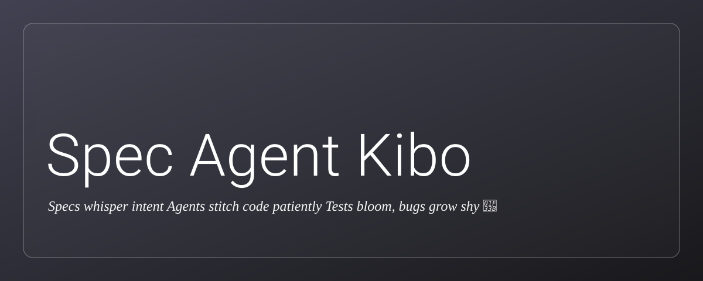

# Spec Agent Kibo



Your system for spec-driven agentic development.

Spec Agent Kibo 😉 turns AI coding agents into productive developers by enforcing clear specs, standards, and workflows so they ship quality code the first time.

- Start here: [docs/index.md](docs/index.md)
- Full local docs: [docs/](docs)
- Canonical docs: [buildermethods.com/agent-os](https://buildermethods.com/agent-os)

---

## Install

Works on macOS, Linux, and Windows. On Windows, use Git Bash or WSL. Remote one‑liners are no longer supported; install from a local clone.

Clone this repository:

```bash
git clone https://github.com/waynehearn/agent-os.git
cd agent-os
```

Run the local setup script:

- macOS/Linux (Terminal)

```bash
bash ./setup.sh
```

- Windows (Git Bash or WSL)

```bash
./setup.sh
```

Optional editor integrations (run from your local clone):

- Claude Code

```bash
bash ./setup-claude-code.sh
```

- Cursor (run inside a project repo to add .cursor rules)

```bash
bash ./setup-cursor.sh
```

What the installer does

- Creates ~/.agent-os/standards and ~/.agent-os/instructions
- Installs standards (see standards/tech-stack.md, standards/code-style.md, standards/best-practices.md)
- Installs core instruction flows (plan, create-spec, execute-task(s), analyze)
- Optionally adds IDE-specific commands (Claude Code, Cursor) using local scripts

Verify your install

```bash
bash ./tools/verify-install.sh
# Optional checks
bash ./tools/verify-install.sh --check-claude
bash ./tools/verify-install.sh --check-cursor   # run inside a project with .cursor
```

---

## Quickstart

1. Plan your product (generates .agent-os/product/*)
    - Open: ~/.agent-os/instructions/core/plan-product.md
    - Guide: [docs/quickstart.md](docs/quickstart.md)
2. Create a spec (generates .agent-os/specs/YYYY-MM-DD-feature/*)
    - Open: ~/.agent-os/instructions/core/create-spec.md
    - Example flow: [docs/create-spec-usage.md](docs/create-spec-usage.md)
3. Execute tasks (TDD loop, commits, PR)
    - Open: ~/.agent-os/instructions/core/execute-tasks.md
4. Analyze existing codebase (optional)
    - Open: ~/.agent-os/instructions/core/analyze-product.md

---

## Local documentation

- Start here: [docs/index.md](docs/index.md)
- Installation: [docs/installation.md](docs/installation.md)
- Quickstart: [docs/quickstart.md](docs/quickstart.md)
- Configuration: [docs/configuration.md](docs/configuration.md)
- Create Spec usage: [docs/create-spec-usage.md](docs/create-spec-usage.md)
- Troubleshooting: [docs/troubleshooting.md](docs/troubleshooting.md)
- Smoke tests: [docs/smoke-tests.md](docs/smoke-tests.md)
- Glossary: [docs/glossary.md](docs/glossary.md)

If something’s missing locally, see the canonical docs at [buildermethods.com/agent-os](https://buildermethods.com/agent-os).

---

## What’s inside

- Commands: commands/
- Core instruction flows:
  - Plan Product: instructions/core/plan-product.md
  - Create Spec: instructions/core/create-spec.md
  - Execute Tasks: instructions/core/execute-tasks.md
  - Execute Task: instructions/core/execute-task.md
  - Analyze Product: instructions/core/analyze-product.md
- Claude Code agents (examples):
  - File Creator: claude-code/agents/file-creator.md
  - Context Fetcher: claude-code/agents/context-fetcher.md
  - Git Workflow: claude-code/agents/git-workflow.md

---

## Support & updates

- Troubleshooting: [docs/troubleshooting.md](docs/troubleshooting.md)
- Changelog: [CHANGELOG.md](CHANGELOG.md)
- Project license: [LICENSE](LICENSE)

Created by Brian Casel at Builder Methods — more resources at [buildermethods.com](https://buildermethods.com)
Modified by ChatGPT5 with some prompting from [Wayne.Hearn@kiboecommerce.com](mailto:Wayne.Hearn@kiboecommerce.com)
